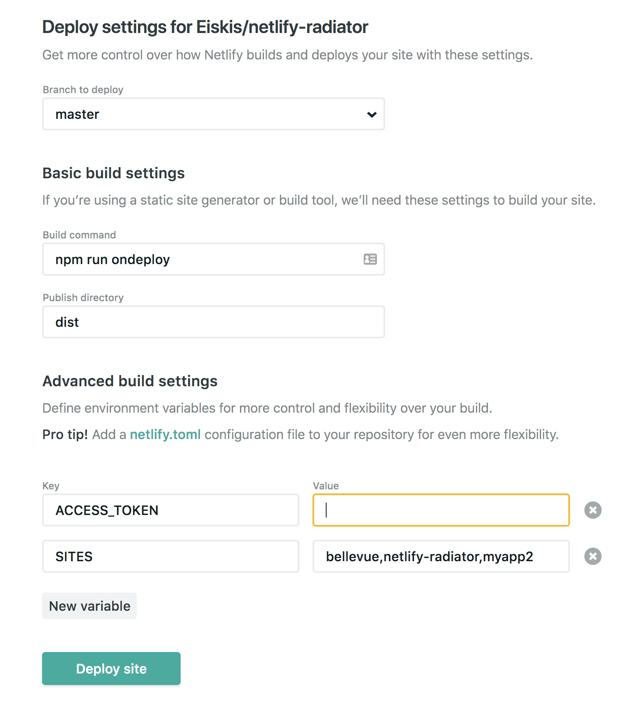

# Netlify radiator

## Requirements

1. Fork repo
2. `npm install`
3. Generate a personal access token on [app.netlify.com/account/applications](https://app.netlify.com/account/applications)

With the access token, this radiator can access your sites via Netlify's API. It doesn't support anything but read operations currently, although the API does support a lot of functionality as [defined in the documentation](https://www.netlify.com/docs/api/).

**Protip:** for increased robustness, use [nvm](https://github.com/creationix/nvm) to ensure you're using the recommended version of Node.

## Deploying to Netlify

You can deploy a copy of this radiator on your Netlify account so you always have the radiator live showing you the status of your projects. Your radiator will be public, but you can choose a cryptic name if you don't want people to find your radiator easily.

### Quick start

#### 1. Deploy this repo on Netlify

The button below will take you to Netlify and let you deploy a new site:

[](https://app.netlify.com/start/deploy?repository=https://github.com/Eiskis/netlify-radiator)

#### 2. Generate a personal access token

Go to on [app.netlify.com/account/applications](https://app.netlify.com/account/applications).



### 3. Add your fork as a new project to Netlify


### Deploy your own fork

If you want to make some customizations, it's easy to deploy your own fork.

First, go to [github.com/Eiskis/netlify-radiator](https://github.com/Eiskis/netlify-radiator) and press fork to have a version on your account.

1. Under "advanced settings", add an environment variable `NETLIFY_ACCESS_TOKEN` with your generated access token as the value.
2. Optional: add an environment variable `NETLIFY_SITES` with a comma-separated list of the site names you want to show. If you don't do this, all your sites will be shown. Each project's `name` is shown as the page title when you navigate to the project on Netlify.

Now you just have to wait for Netlify to deploy your radiator, and you're done! You can edit environment variables in project settings, so you don't have to redeploy to show more sites or change the access token.

## Development

Since you have a fork on your account, you're free to make any edits to the codebase you want.

The project has a Vue-based frontend (on [Bellevue](https://eiskis.gitbooks.io/bellevue/)) and a [Netlify lambda function](https://www.netlify.com/docs/functions/) that fetches project data from your account. For development work, you need to start the client app's Webpack pipeline, and a backend process that runs Netlify lambdas. Both run on node.

For the latter, you'll also need to insert the same options as above using environment variables:

1. Client: Run `npm run dev` to start the client
2. Lambdas: Run `NETLIFY_ACCESS_TOKEN=abcdefgthisismyaccesstoken1234 npm run lambda:dev` to start the backend server

The backend will start up on port `9000` by default. On the client-side this is configured in `config/dev/paths.js`.

If you don't need to make changes to the lambdas, you can also connect to the version you have on Netlify by using your project's URL in the path:

`config/dev/paths.js`
```js
{
  // ...
  functions: 'https://your-site-830jdj.netlify.com/.netlify/functions/'
}
```

This way you don't need to use environment variables locally but you can still develop the frontend.
